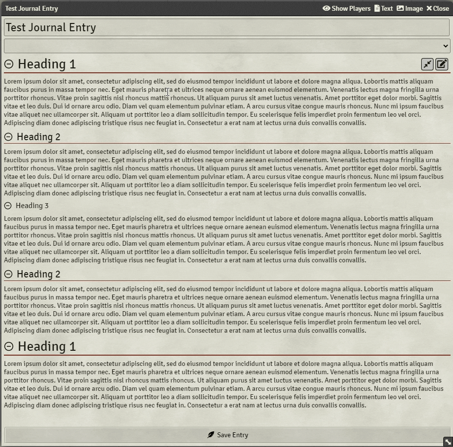
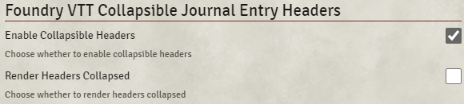

# Foundry VTT Collapsible Journal Entry Headers

A module to inject logic that makes journal entry headers collapsible.

While this module is enabled, any heading tag becomes clickable. Doing so will collapse any text or other content belonging to a lesser header below it. This module also injects a new expand/compress icon buttons in the top left of the journal editor content section (just to the left of the normal edit button). Clicking this will expand or compress all headers depending on the current collapsed state of those headers.

---

## Settings

The module has two settings able to be set on a user-by-user basis. These can be found under `Configure Settings` &rarr; `Module Settings`. The **Enable Collapsible Headers** setting determines whether the module at large is enabled. The **Render Headers Collapsed** setting determines whether all headers will render collapsed when you first open a journal entry.

---

## Dependencies

- Foundry VTT Feather Icons
  - manifest: https://raw.githubusercontent.com/BrettLargent/foundry-vtt-feather-icons/main/module.json
  - url: https://github.com/BrettLargent/foundry-vtt-feather-icons
